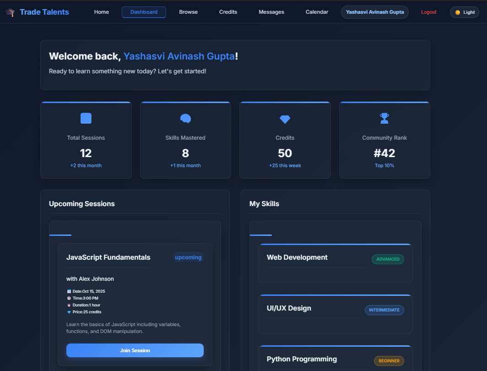
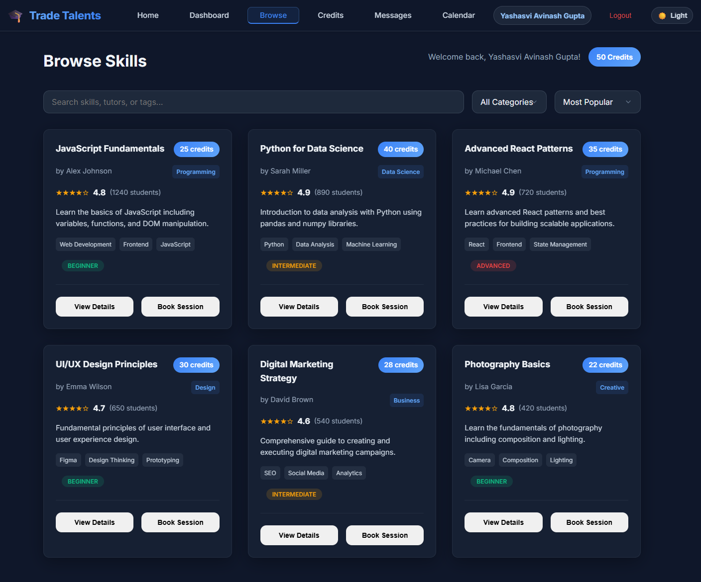
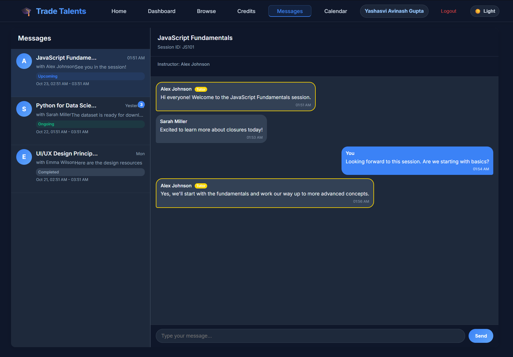

# TradeTalents - Skill Exchange Platform

A MERN stack application for exchanging skills and knowledge between users.

## Features

- User authentication and profile management
- Skill browsing and searching
- Real-time messaging with WebSocket
- Session booking and calendar integration
- Credit-based system for transactions
- Responsive design for mobile and desktop

## UI Screenshots

### Dashboard

*User dashboard with quick stats and actions*

### Skill Browsing

*Browse and search available skills*

### Messaging

*Real-time messaging interface*

## Tech Stack

- **Frontend**: React, Vite, Framer Motion, Socket.IO Client
- **Backend**: Node.js, Express, MongoDB with Mongoose
- **Real-time**: Socket.IO for messaging and notifications
- **Authentication**: JWT tokens
- **Deployment**: Render, vercel

## Getting Started

### Prerequisites

- Node.js (v14 or higher)
- MongoDB Atlas account
- npm or yarn

### Installation

1. Clone the repository:
```bash
git clone <repository-url>
cd TradeTalents
```

2. Install frontend dependencies:
```bash
cd frontend
npm install
```

3. Install backend dependencies:
```bash
cd ../backend
npm install
```

### Environment Variables

#### Frontend (.env)
Create a `.env` file in the frontend directory:
```
VITE_API_URL=http://localhost:5000/api
VITE_BACKEND_URL=http://localhost:5000
```

#### Backend (.env)
Create a `.env` file in the backend directory:
```
NODE_ENV=development
PORT=5000
MONGODB_URI=your_mongodb_connection_string
JWT_SECRET=your_jwt_secret_key
FRONTEND_URL=http://localhost:5173
```

### Running the Application

#### Development Mode

1. Start the backend server:
```bash
cd backend
npm run dev
```

2. Start the frontend development server:
```bash
cd frontend
npm run dev
```

#### Production Mode

1. Build the frontend:
```bash
cd frontend
npm run build
```

2. Start the backend server:
```bash
cd backend
npm start
```

3. Serve the frontend build (using a static server or through the backend)

## Deployment

The application is configured for deployment on Render. The `render.yaml` file contains the deployment configuration.

### Environment Variables for Production

Make sure to set the following environment variables in your Render dashboard:

**Frontend:**
- VITE_API_URL=https://your-backend-url.onrender.com/api
- VITE_BACKEND_URL=https://your-backend-url.onrender.com

**Backend:**
- NODE_ENV=production
- PORT=5000
- MONGODB_URI=your_production_mongodb_connection_string
- JWT_SECRET=your_production_jwt_secret
- FRONTEND_URL=https://your-frontend-url.onrender.com

## Project Structure

```
TradeTalents/
├── frontend/
│   ├── src/
│   │   ├── components/
│   │   ├── contexts/
│   │   ├── pages/
│   │   ├── services/
│   │   └── utils/
│   └── ...
├── backend/
│   ├── controllers/
│   ├── models/
│   ├── routes/
│   ├── middleware/
│   └── config/
└── ...
```

## Key Features Implementation

### Real-time Messaging
- Implemented using Socket.IO
- Supports private messaging between users
- Typing indicators and online status

### Session Booking
- Users can book sessions for skills
- Calendar integration for scheduling
- Real-time updates when sessions are booked

### Skill Exchange
- Users can browse and search skills
- Credit-based system for transactions
- Skill details and tutor information

## Troubleshooting

### MongoDB Connection Issues
1. Ensure your IP address is whitelisted in MongoDB Atlas
2. Check your connection string format
3. Verify your MongoDB credentials

### CORS Issues
1. Check the FRONTEND_URL environment variable
2. Ensure the allowed origins are correctly configured in the backend

### Authentication Issues
1. Verify JWT_SECRET is set correctly
2. Check token expiration settings
3. Ensure proper token handling in frontend

## Contributing

1. Fork the repository
2. Create your feature branch (`git checkout -b feature/AmazingFeature`)
3. Commit your changes (`git commit -m 'Add some AmazingFeature'`)
4. Push to the branch (`git push origin feature/AmazingFeature`)
5. Open a pull request

## License

This project is licensed under the MIT License.

## Contact

For support or questions, please open an issue in the repository.