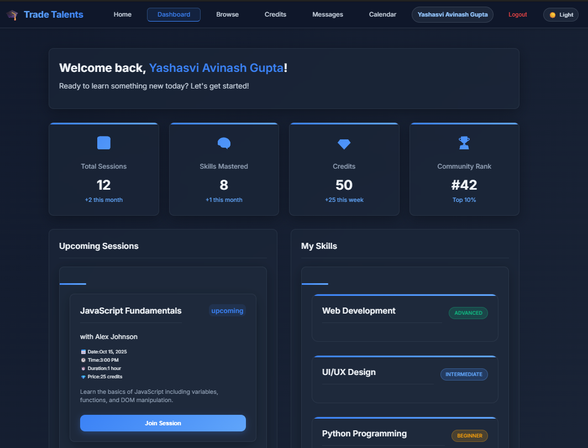
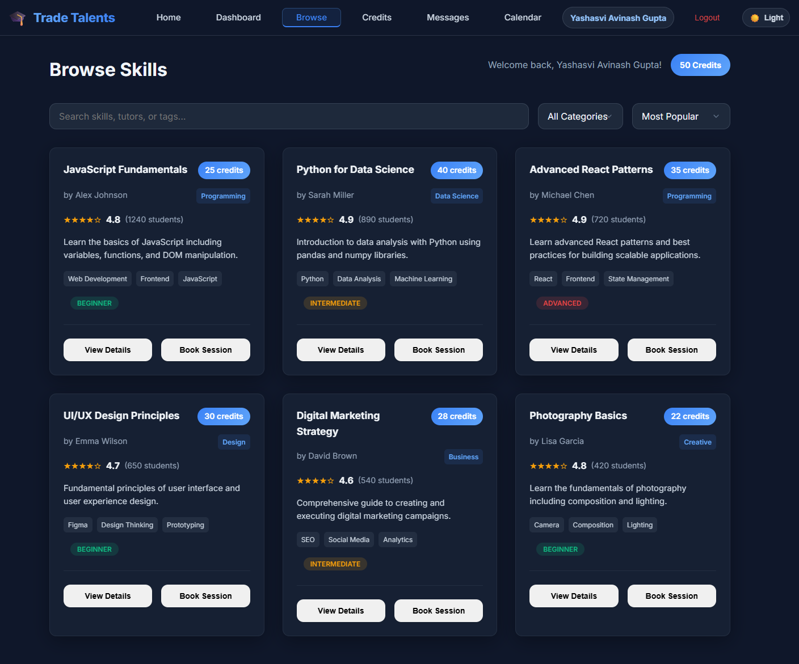
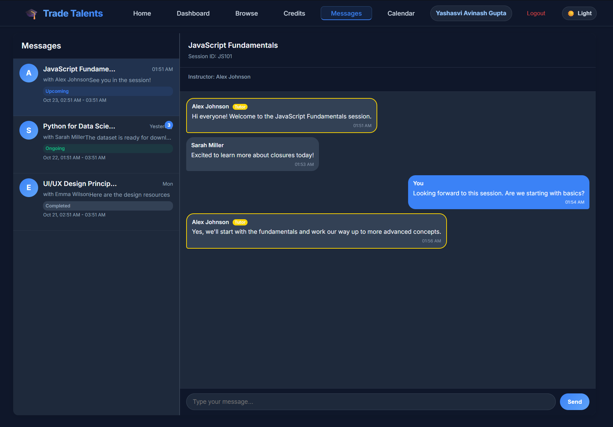

# TradeTalents

TradeTalents is a comprehensive skill exchange platform built with the MERN stack that connects learners and teachers worldwide. Users can share their expertise, learn new skills, and build a vibrant community around knowledge sharing using a credit-based system.

## 🌟 Key Features

### 🔐 User Authentication
- Secure registration and login system with JWT tokens
- Password encryption using bcrypt
- Protected routes for authenticated users only

### 🎯 Skill Management
- Browse and search skills across various categories
- Add your own skills to teach others
- Detailed skill profiles with descriptions and ratings

### 💬 Real-time Communication
- Instant messaging with Socket.IO
- Private chat between users
- Session-specific group chats
- Online status indicators and typing notifications

### 📅 Session Booking
- Schedule one-on-one learning sessions
- Interactive calendar for session management
- Real-time session updates and notifications
- Credit-based transaction system

### 🤖 AI-Powered Assistant
- Talon - Your personal learning assistant powered by Google Gemini
- Context-aware responses for learning support
- Dedicated skill assistant for subject-specific help
- Available throughout the platform for instant assistance

### 📱 Responsive Design
- Fully responsive UI that works on desktop and mobile devices
- Adaptive layouts for optimal viewing experience
- Touch-friendly interface for mobile users

## 🖼️ Screenshots

### Dashboard


### Skill Browsing


### Real-time Chat


## 🛠️ Technology Stack

- **Frontend**: React 18, Vite, TailwindCSS, Framer Motion
- **Backend**: Node.js, Express.js 5.x
- **Database**: MongoDB with Mongoose ODM
- **Real-time**: Socket.IO for instant messaging
- **AI Integration**: Google Gemini API
- **Authentication**: JWT with bcrypt encryption
- **Deployment**: Render hosting platform

## 🚀 Getting Started

### Prerequisites

- Node.js (v16 or higher)
- MongoDB Atlas account
- Google Gemini API key

### Environment Setup

#### Frontend Configuration
Create `frontend/.env`:
```env
VITE_API_URL=http://localhost:5000/api
VITE_BACKEND_URL=http://localhost:5000
```

#### Backend Configuration
Create `backend/.env`:
```env
NODE_ENV=development
PORT=5000
MONGODB_URI=your_mongodb_connection_string
JWT_SECRET=your_secure_jwt_secret
FRONTEND_URL=http://localhost:5173
GEMINI_API_KEY=your_google_gemini_api_key
```

### Installation

1. Clone the repository:
```bash
git clone https://github.com/your-username/trade-talents.git
cd trade-talents
```

2. Install all dependencies:
```bash
npm run install-all
```

### Development Setup

Start both frontend and backend servers concurrently:
```bash
npm run dev
```

Or start each service separately:

**Backend:**
```bash
cd backend
npm run dev
```

**Frontend:**
```bash
cd frontend
npm run dev
```

### Production Deployment

1. Build the frontend:
```bash
npm run build
```

2. Start the backend server:
```bash
npm start
```

## 🏗️ Project Architecture

```
TradeTalents/
├── frontend/
│   ├── src/
│   │   ├── components/     # Reusable UI components
│   │   ├── contexts/       # React context providers
│   │   ├── pages/          # Page-level components
│   │   ├── services/       # API service calls
│   │   └── utils/          # Helper functions
│   └── ...
├── backend/
│   ├── controllers/        # Request handlers
│   ├── models/             # Database schemas
│   ├── routes/             # API endpoints
│   ├── middleware/         # Custom middleware
│   └── config/             # Configuration files
└── ...
```

## 🤝 Contributing

We welcome contributions to improve TradeTalents! To contribute:

1. Fork the repository
2. Create your feature branch (`git checkout -b feature/AmazingFeature`)
3. Commit your changes (`git commit -m 'Add some AmazingFeature'`)
4. Push to the branch (`git push origin feature/AmazingFeature`)
5. Open a pull request

## 👥 Creators

TradeTalents was developed by:
- Siddhant Shukla
- Yashasvi Gupta
- Subhpreet Kaur

From KJ Somaiya School of Engineering

---

*Empowering learners and teachers worldwide through knowledge exchange*